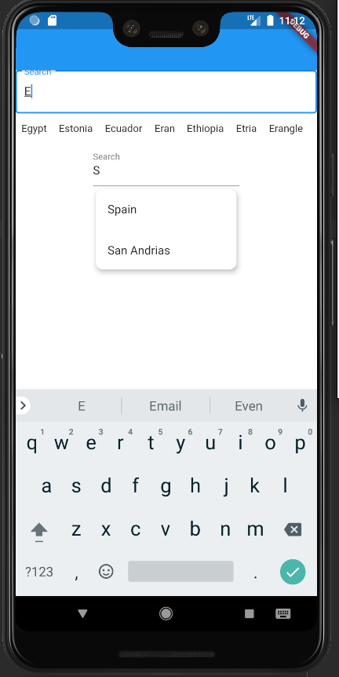
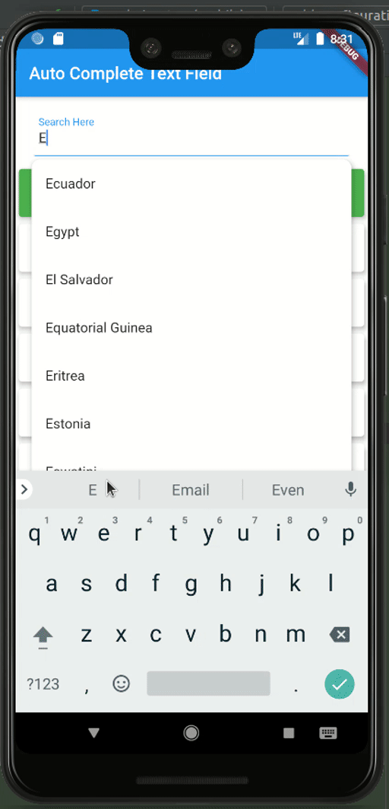

# autocompeletetxtfield

New flutter widget used to complete the input in the text field automatically from the given suggestion with very easy implemention
i dont think that`s this is the first but i hoped to try to publish a custom widget created by me and share it with you guys 

## Getting Started

Hello devs to start using this please start with add ' autocompeletetxtfield: ^0.0.5 ' in your pubspec.yaml file
Enjoy it :) 


###Small Example



###Full Example

you can go to EXAMPLE section to see the code




##Example

```dart
import 'package:flutter/material.dart';
import 'AutoCompeleteTxtField/MultiAutoCompeleteTxtField.dart';

void main() => runApp(MyApp());

class MyApp extends StatelessWidget {
  List<String> countries;
  @override
  Widget build(BuildContext context) {
    return MaterialApp(
      home: mainPage()
    );
  }
}
class mainPage extends StatefulWidget {
  @override
  _MainState createState() => _MainState();
}
class _MainState extends State<mainPage> {
  List<String> countries;
  @override
  void initState() {
    countries=["Egypt","USA","UK","Russia","France","Spain","Itally","San Andrias","Estonia","Ecuador","Eran","Ethiopia","Etria","Erangle"];
    super.initState();
  }
  @override
  Widget build(BuildContext context) {
    return Scaffold(
      backgroundColor: Colors.white,
      appBar: AppBar(),
        body:Column(
        children: <Widget>[
          AutoCompeleteTextField(
            decoration: InputDecoration(
                labelText: 'Search',
                border: OutlineInputBorder()
            ),
            suggestions: countries,
            listElevation: 9.0,
            collapsed: true,
            onTextSubmited: (val){
              
            },
          ),
          AutoCompeleteTextField(
            decoration: InputDecoration(
                labelText: 'Search',
                border: UnderlineInputBorder()
            ),
            suggestions: countries,
            listElevation: 6.0,
            collapsed: false,
            width: 200.0,
            onTextSubmited: (val){

            },
          ),
        ],
      )
    );
  }

}
```
